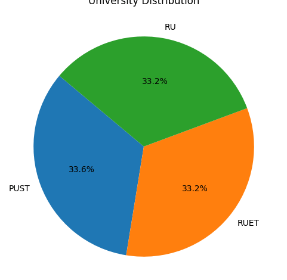

# 📊 AI in Education: Student Perception and Usage Analysis

This project explores student perceptions, trust, and dependency related to Artificial Intelligence (AI) tools used in education. It analyzes survey responses from students across different universities and faculties, focusing on AI familiarity, academic performance, trust, originality concerns, and faculty-wise tool usage.

## 🧠 Dataset

The dataset is collected through a structured survey and contains responses to multiple questions such as:

- University and Faculty
- Academic Level
- Familiarity with AI tools
- Frequency of AI tool usage
- Perceived impact on academic performance
- Trust in AI-generated content
- Instructor attitudes
- Perceptions of originality and creativity

### Sample Columns:
- `4. How familiar are you with Artificial Intelligence (AI) tools used in education?`
- `6. How often do you use AI tools for educational purposes?`
- `9. How do AI tools impact your academic performances?`
- `14. Do you trust the information provided by AI tools?`
- `15. Do you feel AI-generated content lacks originality and creativity?`

## 📈 Visualizations

The following plots and analyses are included in the notebook:

- Box plots comparing **AI familiarity** with:
  - Learning experience
  - Perceived tech dependence
  - Academic performance
- Bar plot showing **AI usage by faculty**
- Crosstab and heatmaps for:
  - AI integration belief vs. instructor perception
  - Trust in AI vs. originality concerns
- Normalized stacked bar plots for proportion-based comparisons

## 🔍 Summary Table

A summary table is generated using `df.describe()` to provide insights into question-level responses, including top answers, frequencies, and unique value counts.

## 🏫 Faculty-wise AI Tool Usage

Analysis of how frequently students from each faculty use AI tools for educational purposes.

## 📊 Demo GIF

The following demo shows the execution and outputs of our visual analysis:

> 💡 Make sure the `.gif` file is placed in the root directory of your repository or adjust the path accordingly.

## 🛠️ Tools & Libraries Used

- Python
- Pandas
- Seaborn
- Matplotlib
- Scikit-learn

## 📁 File Structure

